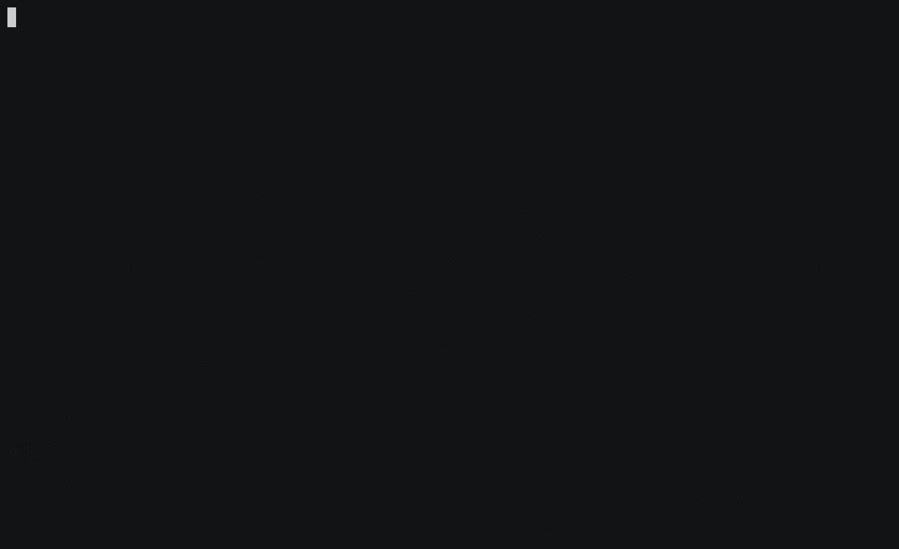

# mull-xctest
Experimental mutation testing tool for Swift and XCTest powered by [mull](https://github.com/mull-project/mull).

**⚠️ This tool is still experimental and under development.**





## Installation

This tool is distributed through [Homebrew](https://brew.sh/). Run the following command to install:

```
brew install kateinoigakukun/tap/mull-xctest
```

## Usage

### SwiftPM

TODO: Add more docs

```
# Compile with bitcode and link by mull-ld in mull-tools directory.
$ swift build --build-tests \
    -Xswiftc -embed-bitcode \
    -Xswiftc -tools-directory -Xswiftc /usr/local/opt/mull-xctest/bin/mull-tools

# Run mutation tests and measure mutation score.
$ mull-xctest .build/debug/StubKitPackageTests.xctest
```

### Xcode

TODO: Add more docs

```
$ xcodebuild build-for-testing \
  -project StubKit.xcodeproj -scheme StubKitTests \
  -destination "platform=iOS Simulator,name=iPhone 8" \
  OTHER_SWIFT_FLAGS="\$(inherited) -embed-bitcode" \
  OTHER_CFLAGS="\$(inherited) -fembed-bitcode" \
  LD="$(which mull-ld)" \
  OTHER_LDFLAGS="\$(inherited) \
    -Xmull --linker=clang \
    -Xmull --linker-flavor=clang"

$ mull-xctestrun \
  -Xxcodebuild -destination \
  -Xxcodebuild "platform=iOS Simulator,name=iPhone 8" \
  --test-target StubKitTests \
  path/to/Build/Products/StubKitTests_iphonesimulator14.4-x86_64.xctestrun

```
